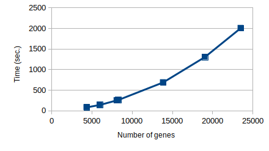
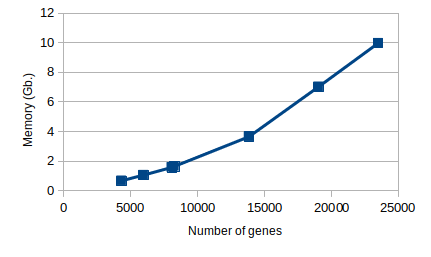
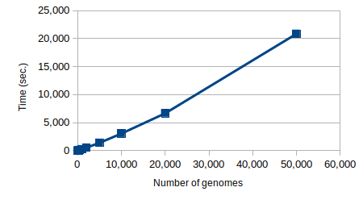
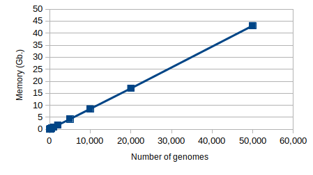

# PANPROVA
## PANgenomic PROkaryotic eVolution of full Assemblies

***PANPROVA*** is a computational tool for simulating pangenomic evolution by evolving the complete genomic sequence of an ancestral isolate.
In this way, the possibility of operating at the pre-assembly stage is enabled.
Gene set variations, sequence variation, and horizontal acquisition from a pool of external genomes are the evolutionary features of the tool.

----

## Brief description

***PANPROVA*** evolves a single root genome into a population of synthetic genomes. The user can specify the phylogenomic relationships between the genomes in the population or leave the tool to create a random phylogenomic tree.
Genomes are evolved from their parent by mutating nucleotides, by duplicating vertically transmitted genes or by altering the set of genes that are present in them via gene removal or acquisition of new horizontal genes.
A nucleotide substitution matrix is employed for nucleotide alterations. Mutations never create or remove the existing start and stop codons.
The horizontal acquisition of new genes is achieved by selecting genetic sequences from a previously created pool or by randomly generating their sequence.
The user can specify the probability of a gene being mutated, thus for each mutated gene, the probability of a nucleotide being mutated, the probability of duplicating a vertically transmitted gene and the percentage of the resultant gene set that as to be altered, by further specifying the probability of adding or removing a gene.

In addition to the base evolution model, ***PANPROVA*** can simulate gene-fusion / chimera-generating mutation events: sub-gene duplication (intra-gene and inter-gene), extended deletion with optional reinsertion of the deleted chunk, translocation, and inversion (intra-gene and inter-gene). Every chimeric event is recorded in a per-run 'chimera log' (`.chimeras.csv` / `.chimeras.tsv`) which, for every contribution, stores the donor and acceptor coordinates at the moment the event was applied. When chimera events are produced, the entire pipeline generates two parallel sets of chimera-aware pangenomic files, corresponding to two possible interpretations of how a chimeric gene relates to its families: a *multi-family membership* ("merge") view, in which the chimera belongs to all of its source families at once, and a *new-family* ("split") view, in which the chimera founds a brand-new gene family of its own.

----

## Requirements

Before running ***PANPROVA***, please verify that the following software is installed on your Linux system
* bash
* g++ version 6 or higher
* python version 3.7 or higher
* biopython
* bcbio-gff ( https://github.com/chapmanb/bcbb/tree/master/gff )
* matplotlib

----

## Installation

Download the software from here or clone the github repository (only if `git` is already installed on your system).
```
git clone https://github.com/InfOmics/PANPROVA.git
```
Enter the `PANPROVA` directory and type
```
bash compile.sh
```
to compile the C++ source code of ***PANPROVA***.

### Docker

A `Dockerfile` is provided to build a self-contained image with all the C++ binaries pre-compiled and all the required Python dependencies (`biopython`, `bcbio-gff`, `matplotlib`) installed. The image sets `PANPROVA_PATH=/opt/panprova` and adds the repo to `PATH`, so `PANPROVA.sh` can be invoked from any working directory inside the container.

Build the image from the repository root:
```
docker build -t panprova .
```

Run an interactive shell with the current directory mounted as `/work`:
```
docker run --rm -it -v "$(pwd)":/work panprova
```

Or run one of the provided examples directly:
```
docker run --rm -v "$(pwd)":/work -w /work/examples/test_12_fusion_all panprova bash run_example.sh
```

----

## Usage

Once the C++ source code has been compiled, the main functionalities of PANPROVA can be accessed via the bash script `PANPROVA.sh`

<br/>

The parameters of the `PANPROVA.sh` script are:
* `-oprefix output_prefix`: a string (path+prefix) that will be used as a prefix for producing output files.
* `-igenome genome_file`: relative or absolute path to the file containing the root genome in PEG format. See next sections for details regarding the PEG format and for instructions on how to convert from GBFF/GFF+FASTA to the PEG format)
* `[-hgtpool hgtpool_file]`: relative or absolute path to the file containing the HGT pool. See the next sections for details regarding the format of this file or how to create it from a set of PEG files. This parameter is optional; if not specified, a blank HGT pool is used.
* `[-psub psub_file]`: a relative or absolute path to the file containing the probability substitution matrix.  The file contains 4 rows, one for each nucleotide A, C, G, T. Each row has 4 columns separated by a space. Each column defines the probability of substituting the given nucleotide with another nucleotide by using the same ordering. Probabilities are expressed as numbers of 0…100. Thus, the sum of each line must be 100. This parameter is optional; if not specified, the default matrix is stored in psubmatrix.txt. by setting every nucleotide to have an equal probability to be altered into any other nucleotide.
* `[-phylo phylo_file]`: a relative or absolute path to the file reporting the phylogenomics relationships between the genomes of the generated population. See the next sections for further details regarding the format of this file or how to obtain it from a PhyloXML file. This parameter is optional, if not specified random phylogenomics relationships are generated for a user-specified number of genomes.
* `[-ngenomes n]`: specify the number of genomes to be created if -phylo is not used. This parameter is optional and is intended to be used only for randomly generated phylogenomics relationships.
* `[-rseed seed]`: seed to be used in random number generations.
* `[-gene-var-prob p]`: the probability of varying a vertically transmitted gene. This parameter is optional; the default value is 0.5. Valid values are between 0 and 1.
* `[-loc-var-prob p]`: the probability of varying (substitute,insert,delete) a nucleotide in a variated gene. This parameter is optional; the default value is 0.01. Valid values are between 0 and 1.
* `[-gene-dup-prob p]`: the probability of duplicating a vertically transmitted gene. This parameter is optional; the default value is 0.001. Valid values are between 0 and 1.
* `[-gset-var-perc p]`: percentage of variation of the gene set, which includes the creation of new genes and the removal of inherited ones. This parameter is optional; the default value is 0.01. Valid values are between 0 and 1.
* `[-gene-add-prob p]`: with respect to the gene set variation, the probability of adding a horizontal gene.  This parameter is optional; the default value is 0.01. Valid values are between 0 and 1. The probability of removing a gene is set as p-1.
* `[--tran-stable table_number]`: translation table to be used for generating translations in GBFF files. The default value is 11.

<br/>

The following parameters control the **gene-fusion / chimera-generating mutation events** (sub-gene duplication, extended deletion, translocation, inversion). They are all optional. Setting `--number-of-fusion-cycles 0` or all of `--gene-fusion-prob`, `--translocation-prob` and `--inversion-prob` to 0 disables the whole block.

* `[--number-of-fusion-cycles n]`: maximum number of mutation events that can occur in a single genome inside the gene-fusion block. Each cycle attempts (independently) a gene-fusion event, a translocation event and an inversion event according to their respective probabilities. Default value is 1. Must be a non-negative integer.
* `[--gene-fusion-prob p]`: probability that a gene-fusion event (sub-gene duplication or extended-deletion reinsertion) is attempted in the current cycle. Default value is 0.001. Valid values are between 0 and 1.
* `[--sub-gene-dup-prob p]`: given that a gene-fusion event occurs, probability that it is a sub-gene duplication. The complementary probability is assigned to extended-deletion reinsertion (`1 - sub-gene-dup-prob`). Default value is 0.001. Valid values are between 0 and 1.
* `[--intra-sub-gene-dup-prob p]`: given a sub-gene duplication, probability that it is intra-gene (a chunk of a gene is reinserted into the same gene). The complementary probability (`1 - p`) is assigned to inter-gene sub-gene duplication (a chunk of one gene is reinserted into a different gene, possibly on the opposite strand). Default value is 0.9. Valid values are between 0 and 1.
* `[--sub-gene-ext-del-prob p]`: probability that an extended-deletion event is performed when a gene-fusion event is sampled and the sub-gene-duplication branch was not chosen. Default value is 0.001. Valid values are between 0 and 1.
* `[--min-gene-num-ext-del n]`: minimum number of genes that an extended-deletion event can span. Must be at least 1. Default value is 1.
* `[--max-gene-num-ext-del n]`: maximum number of genes that an extended-deletion event can span. Must be greater than or equal to `--min-gene-num-ext-del`. If equal to the minimum, every extended deletion will span exactly that many genes. Default value is 3.
* `[--reuse-deleted-genes-prob p]`: given an extended-deletion event, probability that the deleted chunk is reinserted into a different gene (producing a `GENE_FUSION_EXTENDED_DELETION_REINSERTION` chimera). The complementary probability (`1 - p`) is assigned to discarding the deleted chunk (the deletion still produces a fused acceptor gene, logged as `GENE_FUSION_EXTENDED_DELETION_FUSION`). Default value is 0.5. Valid values are between 0 and 1.
* `[--translocation-prob p]`: probability that a translocation event is attempted in the current cycle. A translocation cuts a codon-aligned sub-region from a source gene (preserving its start and stop codons) and reinserts it into a different target gene (also codon-aligned, between the target start and stop codons). Neither gene is removed; the source shrinks, the target grows. Default value is 0.001. Valid values are between 0 and 1.
* `[--inversion-prob p]`: probability that an inversion event is attempted in the current cycle. An inversion physically reverse-complements a codon-aligned sub-region. Depending on where the breakpoints fall, it produces either a single chimera (intra-gene case) or two chimeras (inter-gene case, covering two consecutive genes on the same strand). Default value is 0.001. Valid values are between 0 and 1.
* `[--intra-inversion-prob p]`: given an inversion event, probability that the inversion is INTRA (both breakpoints inside the same gene). The complementary probability (`1 - p`) is assigned to INTER inversions (the two breakpoints fall inside two consecutive genes on the same strand). Intergenic inversions (breakpoints in non-coding regions) are not modeled here, as they would produce no chimera. Default value is 0.5. Valid values are between 0 and 1.

<br/>

The following output is produced by the tool
* `[output_prefix].genome_parents`: which reports the phylogenomics relationships between the genomes of the generated population.
* `[output_prefix].tree.xml`: reports the phylogenomics relationships in the PhyloXML format.
* `[output_prefix].tree.xml.png`: contains an image of the phylogenomics relationships.
* `[output_prefix].gene_parents`: the parenting relationships between all the genetic sequences contained in the produced population.
* `[output_prefix].genome_sequence`: the genomic sequences of the produced population.
* `[output_prefix].genes`: information regarding the genes of the produced genomes: their location within their genome and their nucleotide sequence.
* `[output_prefix].gene_families`: a file that lists the gene families that are present in the generated genomes. Each line is a family. Each gene is identified by a pair reporting the identifier of the genome and the identifier of the gene within the given genome.
* `[output_prefix].family_presence`: a table reporting for each gene family its presence within each generated genome. Each row is a gene family, and each column is a genome. Each cell reports the presence of the given family within the given genome.
* `[output_prefix].pan_distribution`: the pangenomic distribution of genes in the generated population. If X genomes are present in the population, the distribution reports, for each number between 1 and X, the number of genes that are present in a given number of genomes. It is a two-column text file where the first column is the number of genomes, while the second column is the number of genes that are present in exactly that specified number of genomes.
* `[output_prefix]/genomes/*.GBFF`: the produced genomes in GBFF format.
* `[output_prefix]/genomes/*.GFF  [output_prefix]/genomes/*.FASTA`: the produced genomes in GFF+FASTA format.

In addition, when at least one gene-fusion / chimera mutation event is produced (i.e. `--number-of-fusion-cycles > 0` together with non-zero probabilities for any of `--gene-fusion-prob`, `--translocation-prob`, `--inversion-prob`), the following chimera-log files are produced:

* `[output_prefix].chimeras.csv` / `[output_prefix].chimeras.tsv`: the per-contribution log of every chimeric event produced during the simulation, in CSV and TSV formats. See section *`.chimeras.csv / .chimeras.tsv`* below for the column schema. Always emitted; if no chimera event was produced the file contains only the header row.

When chimera events are produced, `PANPROVA.sh` additionally runs a chimera-aware pangenomic distribution post-processing step that emits a parallel set of pangenomic files that take into account multi-family membership of chimeric genes (the *multi-family membership* / "merge" interpretation):

* `[output_prefix].chimeras.gene_families`: same format as `[output_prefix].gene_families`, but a chimeric gene is listed inside every family whose root ancestor is reachable from the gene via the union of vertical-parent edges and chimeric-donor edges.
* `[output_prefix].chimeras.family_presence`: same format as `[output_prefix].family_presence`, computed on the chimera-aware family assignment described above.
* `[output_prefix].chimeras.pan_distribution`: same format as `[output_prefix].pan_distribution`, computed on the chimera-aware family assignment described above.
* `[output_prefix].chimeras.ancestry`: a flat denormalized TSV listing, for every gene, every ancestor edge. Columns are `genome_id`, `gene_id`, `relation`, `ancestor_genome_id`, `ancestor_gene_id`, `event_type`. The `relation` column is either `vertical_parent` (one row per gene, from `.gene_parents`; family roots and HGT genes use `(-1, -1)` and `event_type = "-"`) or `chimeric_donor` (one row per chimera contribution; self-donor rows for `INTRA`-* events are preserved and can be filtered by `genome_id, gene_id == ancestor_genome_id, ancestor_gene_id`).

`PANPROVA.sh` then runs a second post-processing step that emits a parallel set of files implementing the alternative *new-family* ("split") interpretation, in which every genuinely chimeric gene (an acceptor that received material from at least one *other* gene) founds a brand-new gene family of its own — inherited by its vertical descendants — instead of joining its donor families:

* `[output_prefix].chimeras_newfam.gene_families`: same format as `[output_prefix].gene_families`. A genuinely chimeric gene leaves its vertical family and is placed in a new `family_chimera_<genome_id>_<gene_id>` family that its vertical descendants inherit; the pre-fusion ancestor stays in the original family and every other gene resolves to its vertical family as usual. The result is a partition (every gene belongs to exactly one family).
* `[output_prefix].chimeras_newfam.family_presence`: same format as `[output_prefix].family_presence`, computed on the new-family assignment described above.
* `[output_prefix].chimeras_newfam.pan_distribution`: same format as `[output_prefix].pan_distribution`, computed on the new-family assignment described above.

Producing both sets of files lets you compare the two interpretations on the same run.

----

## Detailed description

The following picture gives a detailed description of the PANPROVA workflow.

<p align="center">

 </p>

The workflow consists of a set of internal tools, Python scripts, and C++ executables, as well as some external Python scripts that can be used for file format conversions.

Sections with a yellow background are the internal tools responsible for the `PANPROVA.sh` script. 

<br/>

The internal tools are:
* `create_hgt_pool`: a C++ executable for creating an HGT pool from a set of PEG files. It also takes as input the root genome in order to discard genes that are similar to the genetic sequences within the root genome.
* `generate_tree.py`: a Python script for randomly generating a phylogenomic tree of the wanted population.
* `tree2phyloxml.p`: a tool for converting a PANPROVA tree into a PhyloXML file and for generating an image showing it.
* `evolve`: a C++ executable that implements the evolution procedure and gene-fusion events.
* `get_pan_distrs.py`: a Python script for retrieving pangenomic information from the generated population and for creating the corresponding output.
* `get_pan_distrs_chimeric.py`: a Python script that produces the chimera-aware pangenomic distributions (multi-family membership interpretation) by combining `.gene_parents` with `.chimeras.csv`. It is invoked by `PANPROVA.sh` whenever at least one chimera event is produced and emits the `.chimeras.{gene_families,family_presence,pan_distribution,ancestry}` files.
* `get_pan_distrs_chimeric_newfam.py`: a Python script that produces the alternative *new-family* chimera-aware pangenomic distributions from the same `.gene_parents` and `.chimeras.csv` inputs. It is invoked by `PANPROVA.sh` alongside `get_pan_distrs_chimeric.py` whenever at least one chimera event is produced and emits the `.chimeras_newfam.{gene_families,family_presence,pan_distribution}` files.
* `pegs2gxx.py`: a Python script for converting the generated genomes into the GBK and GFF+FASTA formats.

----

### Extraction of HGT pool

The pool of HGT genes to be used during the evolution simulation is extracted from a set of input genomes (in PEG format), and by taking into account genes that are already present in the root genome (still in PEG format), to exclude genes similar to them from the HGT pool.
The following picture illustrates the main steps of the extraction procedure.

<p align="center">

 </p>

From the given input genomes, a set of genes that are not similar to the genes present in the root genome is initially extracted. A nonredundant pool of genes is then created by discarding genes that are similar to other genes in the initial set.
The similarity among nucleotide genetic sequences is computed by taking into account the similarity between their k-mer content [1]. In particular, a Jaccard similarity between k-mer multisets of two genetic sequences is computed. Genes with a similarity greater than 0.3 with root genes are discarded. Subsequently, we assigned an arbitrary order to the surviving genes. Then, each gene is compared with genes that come after it in the ordering. If the similarity is greater than 0.5, then the latter gene is marked to be discarded. At the end of the scanning, all the genes that were marked are removed from the HGT pool.

### Evolution procedure

The workflow of the evolution procedure, together with examples (in yellow boxes) of intermediate data, is shown in the following figure. 

<p align="center">

 </p>

The workflow refers to the case in which the generation of the random phylogenomic tree is integrated into the process.
<br/>

At each step, a genome from the current population is chosen to be the parent of the next genome to be created. Thus, the parent genome is cloned, and an initial version of the child genome is produced (see example 1 of the figure).
<br/>

Then, according to a given probability, each vertically transmitted gene is selected to be altered or not. If yes, its loci are varied according to a given variation percentage. Possible variations are substitution, insertion or deletion.
The tool allows for the specification of user-defined substitution probabilities for nucleotides by providing a file containing these values. By default, every nucleotide can be substituted by any other nucleotide with equal probability.
Any modification is applied such that it does not produce or modify any start or stop codon of genes that overlap the gene that is currently modified. Overlapping genes may reside on both strands.
Because valid genetic sequences must be provided, substitution regards one nucleotide at a time, while insertion and deletion regard 3 nucleotides at a time, such that the length of the resulting sequence is still a multiple of 3.
<br/>
Ts/Tv ratio and synonym/non-synonym mutation ratio are intended to be the effects of the alterations that are performed on genetic sequences; thus, they can not be specified as input parameters. We are aware that more complex models of sequencing alteration are available at the state of the art. However, the main aim of  ***PANPROVA*** is to simulate pangenomic effects, mainly due to the acquisition and deletion of genes. An extension of the software by us or the research community may include more accurate models.
<br/>

Subsequently, variated vertically transmitted genes are selected to be duplicated within the new genome according to a given probability.
<br/>

Duplication, insertion of HGT genes and transposition of genes are made such that a random locus of the genome is chosen. Any other gene must not cover the locus. Thus, the genetic sequence of the gene, together with start and stop codons, is inserted at the selected locus. See examples 2 and 4 of the figure.
A given percentage modifies the resultant gene set. If the set is composed of n genes and 2% of the set has to be varied, then (n/100) x 2 variation operations are performed. Such an operation can be a horizontal gene acquisition or a gene removal. If the probability that an operation is an acquisition is p, then the probability that the operation is a removal is 1-p.
<br/>

In the case of gene removal, a gene is randomly chosen to be removed. All the nucleotides that belong to the selected gene are removed from the genome if they do not overlap with other genes. See example 3 of the figure.
<br/>

In case of gene acquisition, if the HGT pool is not empty, a genetic sequence is randomly chosen from the pool, inserted in the genome and removed from the pool. See example 4 of the figure. If the HGT pool is empty, a purely random nucleotide sequence is generated and inserted within the genome.
<br/>

Subsequently, a random subset of genes is selected for transposition according to a specified probability.
<br/>

Then, a gene-fusion / chimera-generating mutation block is executed. This block models structural rearrangements that fuse pieces of different genes (or of the same gene) into a single chimeric gene. For each genome, the block is repeated for up to `--number-of-fusion-cycles` cycles. Inside each cycle, up to three classes of events are independently attempted, each according to its own probability: a gene-fusion event (with probability `--gene-fusion-prob`), a translocation event (with probability `--translocation-prob`), and an inversion event (with probability `--inversion-prob`). When an event fires, a `ChimeraRecord` is appended to the per-run chimera log (one row per *contribution* in the resulting `.chimeras.csv`/`.tsv` file).
<br/>

The supported event types (as reported in the `event_type` column of the chimera log) are:

* `GENE_FUSION_INTRA_SUB_GENE_DUPLICATION`: a codon-aligned sub-region of a gene is duplicated and reinserted into the same gene, producing a chimera made of two copies (possibly partial) of the original gene joined together.
* `GENE_FUSION_INTER_SUB_GENE_DUPLICATION`: a codon-aligned sub-region of a *donor* gene is duplicated and reinserted into a different *acceptor* gene. If the donor and acceptor are on opposite strands, the inserted chunk is reverse-complemented (the `reverse_complemented` column is set to 1 in the chimera log).
* `GENE_FUSION_EXTENDED_DELETION_FUSION`: a codon-aligned sub-region that spans 2 or more consecutive genes (the number of genes is uniformly sampled in `[--min-gene-num-ext-del, --max-gene-num-ext-del]`) is deleted from the genome. The flanks of the deleted region are fused together, producing a single chimeric acceptor gene whose sequence is the concatenation of fragments coming from the leftmost and the rightmost gene of the deletion range. This event is always emitted by an extended-deletion event; it documents the in-place fusion that the deletion creates.
* `GENE_FUSION_EXTENDED_DELETION_REINSERTION`: with probability `--reuse-deleted-genes-prob`, the chunk that was just removed by an extended-deletion event is re-inserted into another, randomly chosen acceptor gene. This produces additional chimera rows (one per contributing source gene) that share the `event_id` with the corresponding `GENE_FUSION_EXTENDED_DELETION_FUSION` row.
* `MUTATION_TRANSLOCATION`: a codon-aligned sub-region of a *source* gene is cut out (preserving its start and stop codons) and re-inserted into a different *target* gene (also codon-aligned, between the target start and stop codons). Neither gene is removed; the source shrinks, the target grows. If source and target are on opposite strands, the moved chunk is reverse-complemented.
* `MUTATION_INVERSION_INTRA`: an inversion whose two breakpoints fall inside the same gene. The codon-aligned sub-region between the breakpoints is physically reverse-complemented in place. A single chimera row is emitted; `reverse_complemented` is always 1.
* `MUTATION_INVERSION_INTER`: an inversion whose two breakpoints fall inside two consecutive same-strand genes. After reverse-complementation, the gene-A becomes `head_A + RC(head_B)` and the gene-B becomes `RC(tail_A) + tail_B`. Two chimera rows are emitted (one per affected gene) sharing the same `event_id`; both have `reverse_complemented = 1`.
<br/>

For every chimera contribution, the log records a snapshot of the acceptor and donor coordinates and strands at the moment the event was applied (the `*_start_at_event`, `*_end_at_event`, `*_strand_at_event` columns), so that each row remains interpretable even if a later mutation in the same evolution step re-maps the coordinates or flips the strand of the same gene. The `acceptor_offset` column is gene-relative (measured from the acceptor gene start), so it stays valid across subsequent mutations that shift genome-absolute positions.
<br/>

Lastly, the new genome is added to the population, and the process is repeated until the desired number of genomes is produced. Every time a new genome is created, its parenting relationships are recorded. In particular, the information regarding the genome from which it has been cloned is stored. In addition, for each gene in the new genome, the information regarding the parent gene is stored. For vertically transmitted genes, such information reports the identifiers of the gene present in the parent genome. For duplicated genes, such information reports the identification of the paralog gene from which the gene has been duplicated. For horizontally transmitted genes, such information is null. See example 5 of the Figure.

----

## File formats and internal identifiers

### .PEG
A .PEG file contains the nucleotide sequence of a genome together with the coordinates of its genes.
The first line of the file is the nucleotide sequence, which must be in uppercase and can only contain the following characters: A, C, G, T, and N.
Subsequent lines report the genetic coordinates, one gene per line. Coordinates are in the form  start_position end_position strand, which are separated by a space character.
Start and end positions are integer numbers and always refer to position 0 of the 5’-3’ strand, even if the gene is located on the other strand. The values of the strand are 1 or -1 for 5’-3’ and 3’-5’ respectively.

### .genome_parents (or .tree)
A genome parents file reports the parenting information of the genomes in the produced population.
The root genome is identified with the number 0, and its parent is -1.
The file contains multiple lines, one for each genome in the collection.
Each line contains two integers separated by a space character. The first integer is the identifier of a given genome, the second integer is the identifier of its parent genome.

### .genome_sequences
A genome sequences file reports the nucleotide sequence of each generated genome.
The file contains multiple lines, one for each genome. In each line, the numeric identifier of the genome is followed by a space and subsequently by the entire nucleotide sequence of the genome.

### .gene_parents
A .gene_parents file reports the parenting information of every gene that is present in the produced population of genomes.
Each line of the file reports the parenting information regarding a single gene, and it is in the format  genome_id gene_id parent_genome_id parent_gene_id.
The four identifiers are separated by a space character.
Genes of the root genome have -1 -1 parent, and the same applies to genes that have been horizontally acquired.
The parent of a duplicated gene is the paralog gene that is the source of the duplication, thus the gene that was already present in the same genome. This means that only for duplicated genes genome_id is equal to parent_genome_id.

### .genes
A .gene file contains the information regarding all the genes that are present in the generated population. Each line of the file regards a single gene.
Lines are in the form:
```
genome_id:gene_id:(start_poistion,end_poistion,strand) sequence
```
Thus, there is a space between the first part of the line and the nucleotide sequence of the given gene.
Start and end positions are integer numbers and always refer to position 0 of the 5’-3’ strand, even if the gene is located in the other strand. The values of the strand are 1 or -1 for 5’-3’ and 3’-5’ respectively.

### .chimeras.csv / .chimeras.tsv
A chimera log file reports the per-contribution log of every chimeric event produced during the simulation. The two files have the same content; one uses `,` as a field separator, the other uses `\t`. The first line is a header. Each subsequent line is a single contribution to a chimera event (so a single event can produce multiple lines that share the same `event_id`).

The columns are:

| Column | Type | Description |
|--------|------|-------------|
| `event_id` | int | Per-run unique identifier of the chimera event. Multiple rows can share the same `event_id` (e.g. an `EXTENDED_DELETION_REINSERTION` event whose chunk came from multiple source genes, or an `INVERSION_INTER` event that affects two consecutive genes). |
| `event_type` | string | One of `GENE_FUSION_INTRA_SUB_GENE_DUPLICATION`, `GENE_FUSION_INTER_SUB_GENE_DUPLICATION`, `GENE_FUSION_EXTENDED_DELETION_FUSION`, `GENE_FUSION_EXTENDED_DELETION_REINSERTION`, `MUTATION_TRANSLOCATION`, `MUTATION_INVERSION_INTRA`, `MUTATION_INVERSION_INTER`. See *Detailed description* for the semantics of each type. |
| `acceptor_genome_id` | int | Genome id of the gene that received the contribution. |
| `acceptor_gene_id` | int | Gene id of the acceptor gene inside its genome. |
| `acceptor_offset` | int | Offset (in nucleotides) inside the acceptor gene at which the contribution was inserted. The offset is **gene-relative**, measured from the post-mutation start of the acceptor gene, so it stays valid across subsequent mutations that shift genome-absolute positions. |
| `acceptor_start_at_event` | int | Snapshot of the acceptor gene start coordinate at the moment the event was applied (before the mutation modified the genome). |
| `acceptor_end_at_event` | int | Snapshot of the acceptor gene end coordinate at the moment the event was applied. |
| `acceptor_strand_at_event` | int | Snapshot of the acceptor gene strand at the moment the event was applied: `1` for 5'-3', `-1` for 3'-5'. |
| `donor_genome_id` | int | Genome id of the gene from which the contribution comes. For `INTRA_*` events this is equal to `acceptor_genome_id`. |
| `donor_gene_id` | int | Gene id of the donor gene inside its genome. For `INTRA_*` events this is equal to `acceptor_gene_id` (self-donor). |
| `donor_offset` | int | Offset (in nucleotides) inside the donor gene at which the contribution starts. |
| `contribution_length` | int | Length (in nucleotides) of the contribution. |
| `donor_start_at_event` | int | Snapshot of the donor gene start coordinate at the moment the event was applied. |
| `donor_end_at_event` | int | Snapshot of the donor gene end coordinate at the moment the event was applied. |
| `donor_strand_at_event` | int | Snapshot of the donor gene strand at the moment the event was applied. |
| `reverse_complemented` | int | `1` if the chunk was physically reverse-complemented before being inserted into the acceptor, `0` otherwise. Set to `1` for: cross-strand inter sub-gene duplication, cross-strand translocation, and every contribution of any inversion event. |

### .chimeras.gene_families / .chimeras.family_presence / .chimeras.pan_distribution
These files share the format of `.gene_families`, `.family_presence` and `.pan_distribution` respectively. They differ only in how family membership is computed: a chimeric gene is listed inside every family whose root ancestor is reachable via the union of vertical-parent edges (`.gene_parents`) and chimeric-donor edges (`.chimeras.csv`). A non-chimeric gene appears in exactly one family, exactly as in the corresponding non-chimera-aware file. This is the *multi-family membership* ("merge") interpretation: a chimeric gene can belong to several families at once, so these files are **not** a partition of the genes.

### .chimeras_newfam.gene_families / .chimeras_newfam.family_presence / .chimeras_newfam.pan_distribution
These files share the format of `.gene_families`, `.family_presence` and `.pan_distribution` respectively, and implement the alternative *new-family* ("split") interpretation of a chimeric gene (as opposed to the multi-family membership of the `.chimeras.*` files). A gene is considered *genuinely chimeric* if it is the acceptor of at least one contribution whose donor is a different gene; self-donor `INTRA_*` events do not count, consistently with the `.chimeras.*` files, whose traversal also skips self-donor edges. Each genuinely chimeric gene founds a brand-new family labelled `family_chimera_<genome_id>_<gene_id>`, which is inherited by its vertical descendants, while its pre-fusion ancestor stays in the original family. Every other gene resolves to its vertical-lineage family exactly as in `.gene_families`. Unlike the `.chimeras.*` files, the result is a strict partition: every gene belongs to exactly one family.

### .chimeras.ancestry
A flat denormalized TSV listing, for every gene, every ancestor edge. The first line is a header.

The columns are `genome_id`, `gene_id`, `relation`, `ancestor_genome_id`, `ancestor_gene_id`, `event_type`.

The `relation` column is either:
* `vertical_parent`: one row per gene, sourced from `.gene_parents`. For family roots (the ancestral genes of genome 0) and for HGT-acquired genes, the ancestor is `(-1, -1)` and `event_type` is `-`.
* `chimeric_donor`: one row per chimera contribution from `.chimeras.csv`. The `event_type` column reports the corresponding event type. Self-donor rows (rows where `(genome_id, gene_id) == (ancestor_genome_id, ancestor_gene_id)`, produced by `INTRA_*` events) are preserved here, so the file can be used to fully reconstruct the per-event ancestry; filter them out trivially if not needed.

----

## Utilities

* `gff2peg.py ifile.gff ofile.peg`: a Python script for converting a GFF+FASTA file into the PEG file
* `gbk2peg.py ifile.gbk ofile.peg`: a Python script for converting a GBFF file into a PEG file.
* `phyloxml2tree.py ifile.phyloxml ofile.genome_parents`: a Python script for extracting the parenthood information from a PhyloXML file into the internal format of PANPROVA (PEG). The phylogenomic distance, as well as any other information that does not regarding parenthood, is not taken into account. Only rooted trees can be used.
* `tree2phyloxml.py ifile.genome_parents ofile.phyloxml`: a Python script to convert internal tree format to PhyloXML
* `fragment.py ifile.gbff ofile.fasta`: simulate a fragmentation of a given genome provided as a genebank file. The result is a FASTA file containing the fragments. For each fragment, the file also reports the start and end coordinates within the original genome. Information regarding input genes and their correspondence with fragments is printed on the screen. However, final users may be interested in other types of fragmentation. For example, fragmentation by sequencing simulation can be preferred and more realistic. We recall that there exist specialised methods for this purpose, such as in [5].

----

## Examples

The provided tests were aimed at simulating real-life situations. In fact, the mycoplasma pangenome (tests 1 and 2) is often involved in computational experiments regarding bacteria because it is one of the smallest genomes, and several pangenomic tools show experiments on this genus [2]. The same applies to the third test in which an Escherichia coli genome is used as root genome [3]. Several computational experiments are at the state of the art for simulating the evolution of Escherichia coli [4], and pangenomic tools performance are also shown on these populations. However, their experiments do not take into account pangneomic properties of the generated population, which is the main purpose of PANPROVA. Of course, they apply more complex sequence alteration models, in terms of variation of the nucleotide sequence, but in our opinion, they can not be directly compared with PANPROVA because of the different aims.

Examples are located in the directory `examples` of this repository.

Input genomes are located in the directory `exmaples/genomes`. They are in PEG format produced from GBFF files via the `gb2peg.py` script.

### Test 1 : HGT pool extraction (2 genomes) and evolution from a Mycoplasma genitalium genome
The example retrieves the HGT pool from two genomes (bacillus_subtilis_168 and campylobacter_jejuni_NCTC11168).
Then it runs the evolution by using the mycoplasma_genitalium_G37 genome as root genome.
A population of 1000 genomes is generated with default evolutionary parameters.
To run the example, enter in the example directory and run `bash run_example.sh`.
<br/>
Because the extraction of the HGT pool for this example may require a long time, the folder contains an already extracted pool. 
It is the result of line 9 of `run_exmaple.sh`, so the user can comment the line and uses the previously extracted pool.

### Test 2 : HGT pool extraction (7 genomes) and evolution from a Mycoplasma genitalium genome
This example reflects example 1 with the exception that 7 genomes are used to create the HGt pool. the genomes are listed in the file `hgt_list.txt`
To run the example, enter in the example directory and run `bash run_example.sh`.

### Test 3 : HGT pool and evolution of Escherichia coli
An HGT pool from 7 Escherichia coli genomes of different strains is extracted.
the HGT pool is used to produce a population of 1000 genomes by using escherichia_coli_O157H7 as root genome.
To run the example, enter in the example directory and run `bash run_example.sh`.

### Test 4 : creating the HGT pool by increasing the number of input genes
This example investigates the running time of the HGT creation procedure on varying the number of input genomes and thus the number of input genes that must be compared in order to obtain an unredundant collection of genetic sequences.
To run the example, enter in the example directory and run `bash run_example.sh`.
A previously produced output is present. It shows the obtained results by the images time.png and memory.png.
The example was run on a Intel(R) Core(TM) i7-5960x with 64-Gb of RAM machine running a Ubuntu 64-bit 18.04 LTS system.





### Test 5 : producing populations of different sizes
This example investigates the running time of the evolution procedure on generating populations with a different number of genomes.
It reflects the configuration of Example 1 except for the number of generated genomes.
To run the example, enter in the example directory and run `bash run_example.sh`.
A previously produced output is present. 
The example was run on a Intel(R) Core(TM) i7-5960x with 64-Gb of RAM machine running a Ubuntu 64-bit 18.04 LTS system.






### Test 6 : reproducing the phylogentic tree
This example shows a testing of ***PANPROVA*** run with a user-provided phylogeny and that further compares this input phylogeny with  both the output phylogeny reported by ***PANPROVA***, and  the phylogeny reconstructed based on the simulated genomes produced by ***PANPROVA***.
In order to demonstrate this, we ran a modified version of example 1 in which we provided a phylogeny with 20 genomes as input (example.tree). ***PANPROVA*** was run on this phylogeny, and the resulting 20 genomes were produced. Then, we computed genomic similarity between the generated genomes by means of the CVTree software (https://github.com/ghzuo/CVTree), which implements a well-established methodology for computing bacterial similarity (similarities.pdf). Then, we reconstructed the phylogenetic tree (tree.pdf). This experiment shows that the reconstructed tree follows the original phylogenetic relationship among the genomes


### Test 7 : multiple sequence alignments of gene families
This example shows how to obtain a multiple sequence alignment for each generated gene family.</br>
It uses MUSCLE to compute alignments. It is supposed that MUSCLE has already been installed on the system.</br>
For each gene family, a file named MFS is created in the `omsa` folder.

### Test 8 : gene-fusion / sub-gene duplication
This example exercises the sub-gene duplication branch of the gene-fusion block. It evolves 10 genomes from a *Mycoplasma genitalium* root with all base evolution probabilities at their defaults and only sub-gene duplication enabled (`--gene-fusion-prob 1.0`, `--sub-gene-dup-prob 1.0`, `--intra-sub-gene-dup-prob 0.5`, every other fusion class set to 0). With `--intra-sub-gene-dup-prob 0.5`, the example produces a roughly even mix of `GENE_FUSION_INTRA_SUB_GENE_DUPLICATION` and `GENE_FUSION_INTER_SUB_GENE_DUPLICATION` events in `[output_prefix].chimeras.csv`.
To run the example, enter in the example directory and run `bash run_example.sh`.

### Test 9 : gene-fusion / extended deletion
This example exercises the extended deletion branch of the gene-fusion block. It evolves 10 genomes with `--gene-fusion-prob 1.0`, `--sub-gene-dup-prob 0`, `--sub-gene-ext-del-prob 1.0`, `--min-gene-num-ext-del 1`, `--max-gene-num-ext-del 3`, and `--reuse-deleted-genes-prob 0.5`. Every gene-fusion cycle that fires produces a `GENE_FUSION_EXTENDED_DELETION_FUSION` row in the chimera log, and roughly half of those events also produce one or more `GENE_FUSION_EXTENDED_DELETION_REINSERTION` rows with the same `event_id`.
To run the example, enter in the example directory and run `bash run_example.sh`.

### Test 10 : gene-fusion / inversion
This example exercises the inversion branch. It evolves 10 genomes with `--inversion-prob 1.0` and `--intra-inversion-prob 0.5` (gene-fusion and translocation disabled). It produces a roughly even mix of `MUTATION_INVERSION_INTRA` rows (one row per event) and pairs of `MUTATION_INVERSION_INTER` rows (two rows sharing the same `event_id`, one per affected gene) in the chimera log. Every contribution has `reverse_complemented = 1`.
To run the example, enter in the example directory and run `bash run_example.sh`.

### Test 11 : gene-fusion / translocation
This example exercises the translocation branch. It evolves 10 genomes with `--translocation-prob 1.0` (gene-fusion and inversion disabled). Every fired cycle produces a `MUTATION_TRANSLOCATION` row in the chimera log. The `reverse_complemented` column is `1` whenever source and target lie on opposite strands.
To run the example, enter in the example directory and run `bash run_example.sh`.

### Test 12 : gene-fusion / all events together
This example combines every chimera-generating mutation in a single run, with all probabilities at intermediate values (`--gene-fusion-prob 1.0`, `--sub-gene-dup-prob 0.5`, `--intra-sub-gene-dup-prob 0.5`, `--sub-gene-ext-del-prob 0.5`, `--reuse-deleted-genes-prob 0.5`, `--translocation-prob 0.5`, `--inversion-prob 0.5`, `--intra-inversion-prob 0.5`). It is the most representative example for inspecting the full set of `event_type` values in the chimera log and for exercising both chimera-aware pangenomic post-processing steps: the one that emits the multi-family-membership `[output_prefix].chimeras.{gene_families,family_presence,pan_distribution,ancestry}` files and the one that emits the new-family `[output_prefix].chimeras_newfam.{gene_families,family_presence,pan_distribution}` files.
To run the example, enter in the example directory and run `bash run_example.sh`.

----


## License
PANPROVA is distributed under the MIT license. This means that it is free for both academic and commercial use. Note, however, that some third-party components in PANPROVA require that you reference certain works in scientific publications.
You are free to link or use PANPROVA inside the source code of your own program. If so, please take a look at (cite) PANPROVA and this website. We appreciate bug fixes and would be happy to collaborate for improvements.
[License](https://raw.githubusercontent.com/InfOmics/PANPROVA/master/LICENSE)

## Citation

Bonnici, V. and Giugno, R., 2022. PANPROVA: PANgenomic PROkaryotic eVolution of full Assemblies. Bioinformatics (Oxford Accademic), btac158, https://doi.org/10.1093/bioinformatics/btac158

## References

[1] Bonnici, V., Giugno, R., & Manca, V. (2018). PanDelos: A dictionary-based method for pan-genome content discovery. BMC bioinformatics, 19(15), 47-59.
<br/>
[2] Bonnici, V., Maresi, E., & Giugno, R. (2021). Challenges in gene-oriented approaches for pangenome content discovery. Briefings in Bioinformatics, 22(3), bbaa198.
<br/>
[3] Gabrielaite, M., & Marvig, R. L. (2020). GenAPI: a tool for gene absence-presence identification in fragmented bacterial genome sequences. BMC bioinformatics, 21(1), 1-8.
<br/>
[4] Barrick, J. E., Yu, D. S., Yoon, S. H., Jeong, H., Oh, T. K., Schneider, D., ... & Kim, J. F. (2009). Genome evolution and adaptation in a long-term experiment with Escherichia coli. Nature, 461(7268), 1243-1247.
<br/>
[5] Stephens, Zachary D., Matthew E. Hudson, Liudmila S. Mainzer, Morgan Taschuk, Matthew R. Weber, and Ravishankar K. Iyer. "Simulating next-generation sequencing datasets from empirical mutation and sequencing models." PloS one 11, no. 11 (2016): e0167047.
