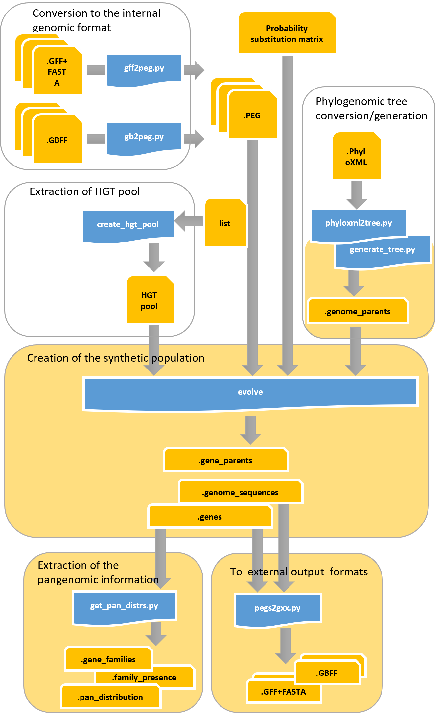

# PANPROVA
## PANgenomic PROkaryotic eVolution of full Assemblies 

***PANPROVA*** is a computational tool for simulating pangenomic evolution by evolving the complete genomic sequence of an ancestral isolate. 
In this way, the possibility of operating at the pre-assembly stage is enabled. 
Gene set variations, sequence variation and horizontal acquisition from a pool of external genomes are the evolutionary features of the tool.

----

## Briefly description 

***PANPROVA*** evolves a single root genome into a population of synthetic genomes. The user can specify the phylogenomic relationships between the genomes in the population or leave the tool to create a random phylogenomic tree. 
Genomes are evolved from their parent by mutating nucleotides, by duplicating vertically transmitted genes or by altering the set of genes that are present in them via gene removal or acquisition of new horizontal genes.
A nucleotide substitution matrix is employed for nucleotide alterations. Mutation never create or remove exiting start and stop codons. 
The horizontal acquisition of new genes is made by picking genetic sequences from a previously created pool or by randomly creating their sequence. 
The user can specify the probability of a gene to be mutated, thus for each mutated gene the probability of a nucleotide to be mutated; the probability of duplicating a vertically transmitted gene and the percentage of the resultant gene set that as to be altered, by further specifying the probability of adding or removing a gene.

----

## Requirements

Before running ***PARPROVA***, please verify that the following software is installed on your Linux system
* bash
* g++ version 6 or higher
* python version 3.7 or higher
* biopython
* bcbio-gff ( https://github.com/chapmanb/bcbb/tree/master/gff )

----

## Installation

Download the software from here or clone the github repository (only if `git` is already installed on your system)
```
git clone https://github.com/InfOmics/PANPROVA.git
````
Enter the `PANPROVA` directory and type 
```
bash compile.sh
```
to compile the C++ source code of ***PANPROVA***.

----

## Usage

Once the C++ source code has been compiled, the main functionalities of PANPROVA can be accessed via the bash script `PANPROVA.sh `

<br/>

The parameters of the `PANPROVA.sh` script are:
* `-oprefix output_prefix`: a string (path+prefix) that will be used as a prefix for producing output files.
* `-igenome genome_file`: relative or absolute path to the file containing the root genome in PEG format. See next sections for details regarding the PEG format and for instructions on how to convert from GBFF/GFF+FASTA to the PEG format)
* `[-hgtpool hgtpool_file]`: relative or absolute path to the file containing the HGT pool. See the next sections for details regarding the format of this file or how to create it from a set of PEG files. This parameter is optional, if not specified a blank HGT pool is used.
* `[-psub psub_file]`: a relative or absolute path to the file containing the probability substitution matrix.  The file contains 4 row, one for each nucleotide A, C, G, T. Each row has 4 columns separated by space. Each column defines the probability of substituting the given nucleotide with another nucleotide by using the same ordering. Probabilities are expressed as numbers of 0…100. Thus the sum of each line must be 100. This parameter is optional, if not specified, the default matrix is stored in psubmatrix.txt. by setting every nucleotide to have an equal probability to be altered into any other nucleotide.
* `[-phylo phylo_file]`: a relative or absolute path to the file reporting the phylogenomics relationships between the genomes of the generated population. See the next sections for further details regarding the format of this file or how to obtain it from a PhyloXML file. This parameter is optional, if not specified random phylogenomics relationships are generated for a user-specified number of genomes.
* `[-ngenomes n]`: specify the number of genomes to be created if -phylo is not used. This parameter is optional and is intended to be used only for randomly generated phylogenomics relationships.
* `[-rseed seed]`: seed to be used in random number generations.
* `[-gene-var-prob p]`: the probability of variating a vertically transmitted gene. This parameter is optional, the default value is 0.5. Valid values are between 0 and 1.
* `[-loc-var-prob p]`: the probability of variating (substitute,insert,delete) a nucleotide in a variated gene. This parameter is optional, the default value is 0.01. Valid values are between 0 and 1.
* `[-gene-dup-prob p]`: the probability of duplicating a vertically transmitted gene. This parameter is optional, the default value is 0.001. Valid values are between 0 and 1.
* `[-gset-var-perc p]`: percentage of variation of the gene set, it includes the creation of new genes and the removal of inherited ones. This parameter is optional, the default value is 0.01. Valid values are between 0 and 1.
* `[-gene-add-prob p]`: with respect to the gene set variation, the probability of adding a horizontal gene.  This parameter is optional, the default value is 0.01. Valid values are between 0 and 1. the probability of removing a gene is set as p-1.
* `[--tran-stable table_number]`: translation table to be used for generating translations in GBFF files. The default value is 11.

<br/>

The following output is produced by the tool
* `[output_prefix].genome_parents`: which reports the phylogenomics relationships between the genomes of the generated population. [output_prefix].gene_parents: the parenting relationships between all the genetic sequences contained in the produced population. 
* `[output_prefix].genome_sequence`: the genomic sequences of the produced population. 
* `[output_prefix].genes`: information regarding the genes of the produced genomes: their location within their genome and their nucleotide sequence.
* `[output_prefix].gene_families`: a file that list the gene families that are present in the generated genomes. Each line is a family. Each gene is identified by a pari reporting the identifier of the genome and the identifier of the gene within the given genome.
* `[output_prefix].family_presence`: a table reporting for each gene family its presence within each generated genome. Each row is a gene family  and each column is a genome. Each cell reports the presence of the given family within the given genome.
* `[output_prefix].pan_distribution`: the pangenomic distribution of genes in the generated population. If X genomes are present in the population, the distribution reports, for each number between 1 and X, the number of genes that are present in a given number of genomes. It is a two-columns text file where the first column is the number of genomes, while the second column is the number of genes that are present in exactly that specified number of genomes.
* `[output_prefix]/genomes/*.GBFF`: the produced genomes in GBK format.
* `[output_prefix]/genomes/*.GFF  [output_prefix]/genomes/*.FASTA`: the produced genomes in GFF+FASTA format.

----

## Detailed description

The following picture gives a detailed description of the PANPROVA workflow.




## License
PANPROVA is distributed under the MIT license. This means that it is free for both academic and commercial use. Note however that some third party components in RI require that you reference certain works in scientific publications.
You are free to link or use RI inside source code of your own program. If do so, please reference (cite) PANPROVA and this website. We appreciate bug fixes and would be happy to collaborate for improvements. 
[License](https://raw.githubusercontent.com/InfOmics/PANPROVA/master/LICENSE)

## Citation
