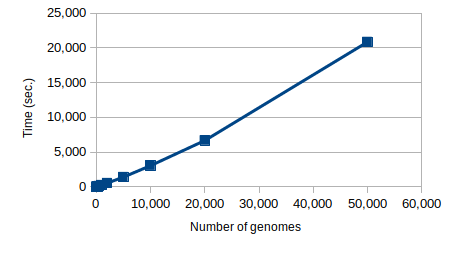
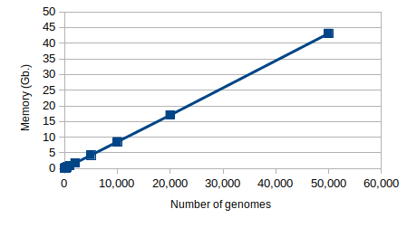

# PANPROVA
## PANgenomic PROkaryotic eVolution of full Assemblies 

***PANPROVA*** is a computational tool for simulating pangenomic evolution by evolving the complete genomic sequence of an ancestral isolate. 
In this way, the possibility of operating at the pre-assembly stage is enabled. 
Gene set variations, sequence variation and horizontal acquisition from a pool of external genomes are the evolutionary features of the tool.

----

## Briefly description 

***PANPROVA*** evolves a single root genome into a population of synthetic genomes. The user can specify the phylogenomic relationships between the genomes in the population or leave the tool to create a random phylogenomic tree. 
Genomes are evolved from their parent by mutating nucleotides, by duplicating vertically transmitted genes or by altering the set of genes that are present in them via gene removal or acquisition of new horizontal genes.
A nucleotide substitution matrix is employed for nucleotide alterations. Mutation never create or remove exiting start and stop codons. 
The horizontal acquisition of new genes is made by picking genetic sequences from a previously created pool or by randomly creating their sequence. 
The user can specify the probability of a gene to be mutated, thus for each mutated gene the probability of a nucleotide to be mutated; the probability of duplicating a vertically transmitted gene and the percentage of the resultant gene set that as to be altered, by further specifying the probability of adding or removing a gene.

----

## Requirements

Before running ***PANPROVA***, please verify that the following software is installed on your Linux system
* bash
* g++ version 6 or higher
* python version 3.7 or higher
* biopython
* bcbio-gff ( https://github.com/chapmanb/bcbb/tree/master/gff )

----

## Installation

Download the software from here or clone the github repository (only if `git` is already installed on your system)
```
git clone https://github.com/InfOmics/PANPROVA.git
````
Enter the `PANPROVA` directory and type 
```
bash compile.sh
```
to compile the C++ source code of ***PANPROVA***.

----

## Usage

Once the C++ source code has been compiled, the main functionalities of PANPROVA can be accessed via the bash script `PANPROVA.sh `

<br/>

The parameters of the `PANPROVA.sh` script are:
* `-oprefix output_prefix`: a string (path+prefix) that will be used as a prefix for producing output files.
* `-igenome genome_file`: relative or absolute path to the file containing the root genome in PEG format. See next sections for details regarding the PEG format and for instructions on how to convert from GBFF/GFF+FASTA to the PEG format)
* `[-hgtpool hgtpool_file]`: relative or absolute path to the file containing the HGT pool. See the next sections for details regarding the format of this file or how to create it from a set of PEG files. This parameter is optional, if not specified a blank HGT pool is used.
* `[-psub psub_file]`: a relative or absolute path to the file containing the probability substitution matrix.  The file contains 4 row, one for each nucleotide A, C, G, T. Each row has 4 columns separated by space. Each column defines the probability of substituting the given nucleotide with another nucleotide by using the same ordering. Probabilities are expressed as numbers of 0…100. Thus the sum of each line must be 100. This parameter is optional, if not specified, the default matrix is stored in psubmatrix.txt. by setting every nucleotide to have an equal probability to be altered into any other nucleotide.
* `[-phylo phylo_file]`: a relative or absolute path to the file reporting the phylogenomics relationships between the genomes of the generated population. See the next sections for further details regarding the format of this file or how to obtain it from a PhyloXML file. This parameter is optional, if not specified random phylogenomics relationships are generated for a user-specified number of genomes.
* `[-ngenomes n]`: specify the number of genomes to be created if -phylo is not used. This parameter is optional and is intended to be used only for randomly generated phylogenomics relationships.
* `[-rseed seed]`: seed to be used in random number generations.
* `[-gene-var-prob p]`: the probability of variating a vertically transmitted gene. This parameter is optional, the default value is 0.5. Valid values are between 0 and 1.
* `[-loc-var-prob p]`: the probability of variating (substitute,insert,delete) a nucleotide in a variated gene. This parameter is optional, the default value is 0.01. Valid values are between 0 and 1.
* `[-gene-dup-prob p]`: the probability of duplicating a vertically transmitted gene. This parameter is optional, the default value is 0.001. Valid values are between 0 and 1.
* `[-gset-var-perc p]`: percentage of variation of the gene set, it includes the creation of new genes and the removal of inherited ones. This parameter is optional, the default value is 0.01. Valid values are between 0 and 1.
* `[-gene-add-prob p]`: with respect to the gene set variation, the probability of adding a horizontal gene.  This parameter is optional, the default value is 0.01. Valid values are between 0 and 1. the probability of removing a gene is set as p-1.
* `[--tran-stable table_number]`: translation table to be used for generating translations in GBFF files. The default value is 11.

<br/>

The following output is produced by the tool
* `[output_prefix].genome_parents`: which reports the phylogenomics relationships between the genomes of the generated population. 
* `[output_prefix].tree.xml`: reports the phylogenomics relationships in the PhyloXML format. 
* `[output_prefix].tree.xml.png`: contains an image of the phylogenomics relationships.
* `[output_prefix].gene_parents`: the parenting relationships between all the genetic sequences contained in the produced population. 
* `[output_prefix].genome_sequence`: the genomic sequences of the produced population. 
* `[output_prefix].genes`: information regarding the genes of the produced genomes: their location within their genome and their nucleotide sequence.
* `[output_prefix].gene_families`: a file that list the gene families that are present in the generated genomes. Each line is a family. Each gene is identified by a pari reporting the identifier of the genome and the identifier of the gene within the given genome.
* `[output_prefix].family_presence`: a table reporting for each gene family its presence within each generated genome. Each row is a gene family  and each column is a genome. Each cell reports the presence of the given family within the given genome.
* `[output_prefix].pan_distribution`: the pangenomic distribution of genes in the generated population. If X genomes are present in the population, the distribution reports, for each number between 1 and X, the number of genes that are present in a given number of genomes. It is a two-columns text file where the first column is the number of genomes, while the second column is the number of genes that are present in exactly that specified number of genomes.
* `[output_prefix]/genomes/*.GBFF`: the produced genomes in GBFF format.
* `[output_prefix]/genomes/*.GFF  [output_prefix]/genomes/*.FASTA`: the produced genomes in GFF+FASTA format.

----

## Detailed description

The following picture gives a detailed description of the PANPROVA workflow.


The workflow is composed of a set of internal tools, Python scripts and C++ executables, plus some external Python scripts that can be used for file format conversions.

Sections with a yellow background are those internal tools that are in charge of the `PANPROVA.sh` script. 

<br/>

The internal tools are:
* `create_hgt_pool`: a C++ executable for creating an HGT pool from a set of PEG files.
* `generate_tree.py`: a Python script for randomly generating a phylogenomic tree of the wanted population.
* `tree2phyloxml.p`: a tool for converting a PANPROVA tre into a PhyloXML file and for genrating an image showing it.
* `evolve`: a C++ executable that implements the evolution procedure. 
* `get_pan_distrs.py`: a Python script for retrieving pangenomic information from the generated population and for creating the corresponding output.
* `pegs2gxx.py`: a Python script for converting the generated genomes into the GBK and GFF+FASTA formats.

----

### Extractiong of HGT pool

The pool of HGT genes to be used during the evolution simulation is extracted from a set of input genomes (in PEG format) and by taking into account genes that are already present in the root genome (still in PEG format).
The following picture illustrates the main steps of the extraction procedure.


From the given input genomes, a set of genes that are not similar to the genes present in the root genome is initially extracted. Then a nonredundant pool of genes is created by discarding genes that are similar to other genes in the initial set. 
The similarity among nucleotide genetic sequences is computed by taking into account the similarity between their k-mer content [1]. In particular, a Jaccard similarity between k-mer multisets of two genetic sequences is computed. Genes with a similarity greater than 0.3 with root genes are discarded. Successively, we set an arbitrary order of the surviving genes. Then, each gene is compared with genes that come after it in the ordering. If the similarity is greater than 0.5, then the latter gene is marked to be discarded. At the end of the scanning, all the genes that were marked are removed from the HGT pool.

### Evolution procedure

The workflow of the evolution procedure, together with examples of intermediate data, is shown in the following figure. 


The workflow refers to the case in which the generation of the random phylogenomic tree is integrated into the process.
<br/>

At each step, a genome from the current population is chosen to be the parent of the next genome to be created. Thus, the parent genome is cloned and an initial version of the child genome is produced (see example 1 of the figure). 
<br/>

Then, according to a given probability, each vertically transmitted gene is selected to be altered or not. If yes, its loci are variated according to a given variation percentage. Possible variations are substitution (in accordance with the specified probability substitution matrix), insertion or deletion. Any modification is applied such that it does not produce or modify any star or stop codon of genes that overlap the gene that is currently modified. Overlapping genes may reside on both strands.
Becuse valid genetic sequences must be provided, subsitution regards one nucleotided at time, while insertion and deletion regard 3 nucleotides a time, such that the length of the resultant sequence is still a multiple of 3.
<br/>

Subsequently, variated vertically transmitted genes are selected to be duplicated within the new genome according to a given probability. 
<br/>

Duplication, insertion of HGT genes and transposition of genes is made such that a random locus of the genome is chosen. the locus must not be covered by any other gene. Thus, the genetic sequence of the gene, together with start and stop codons, is inserted at the selected locus. See examples 2 and 4 of the figure.
The resultant gene set is modified by a given percentage. If the set is composed of n genes and 2% of the set has to be variated, then (n/100)x2 variation operations are performed. such operation can be a horizontal gene acquisition of a gene removal. If the probability that an operation is acquisition is p, then the probability that the operation is a removal is 1-p.
<br/>

In the case of gene removal, a gene is randomly chosen to be removed. All the nucleotides that belong to the selected gene are removed from the genome if they do not overlap other genes. See example 3 of the figure.
<br/>

In case of gene acquisition, if the HGT pool is not empty, a genetic sequence is randomly chosen from the pool, inserted in the genome and removed from the pool. See example 4 of the figure. If the HGT pool is empty, a purely random nucleotide sequence is generated and inserted within the genome.
<br/>

Subsequently, the resultant set of genes is randomly picked for transposition according to a given probability. 
<br/>

Lastly, the new genome is added to the population and the process is repeated until the desired number of genomes is produced. Every time a new genome is produced, its parenting relationships are recorded. In particular, the information regarding the genome from which it has been cloned is stored. In addition, for each gene in the new genome, the information regarding the parent gene is stored. for vertically transmitted genes, such information reports the identifiers of the gene present in the parent genome. For duplicated genes, such information reports the identification of the paralog gene from which the gene has been duplicated. for horizontally transmitted genes, such information is null. See example 5 of the figure.

----

## File formats and internal identifiers

### .PEG
A .PEG file contains the nucleotide sequence of a genome together with the coordinates of its genes. 
The first line of the file is the nucleotide sequence, which must be in upper case and can only contain the following characters: A,C,G,T,N.
Subsequent lines report genetic coordinates, each gene for each line. Coordinates are in the form  start_position end_position strand, which are separated by a space character.
Start and end positions are integer numbers and always refer to position 0 of the 5’-3’ strand, even if the gene is located in the other strand. The values of the strand are 1 or -1 for 5’-3’ and 3’-5’ respectively.
 
### .genome_parents (or .tree)
A genome parents file reports the parenting information of the genomes in the produced population. 
The root genome is identified with the number 0 and its parent is -1.
The file contains multiple lines, one for each genome in the collection.
Each line contains two integers separated by a space character. The first integer is the identifier of a given genome, the second integer is the identifier of its parent genome.

### .genome_sequences
A genome sequences file reports the nucleotide sequence of each generated genome.
The file contains multiple lines, one for each genome. In each line, the numeric identifier of the genome is followed by a space and subsequently by the entire nucleotide sequence of the genome.

### .gene_parents
A .gene_parents file reports the parenting information of every gene that is present in the produced population of genomes.
Each line of the file reports the parenting information regarding a single gene, and it is in the format  genome_id gene_id parent_genome_id parent_gene_id.
The four identifiers are separated by a space character.
Genes of the root genome have -1 -1 parent, and the same applies to genes that have been horizontally acquired.
The parent of a duplicated gene is the paralog gene that is the source of the duplication, thus the gene that was already present in the same genome. This means that only for duplicated genes genome_id is equal to parent_genome_id.

### .genes
A .gene file contains the information regarding all the genes that are presented in the generated population. Each line of the file regards a single gene.
Lines are in the form:
```
genome_id:gene_id:(start_poistion,end_poistion,strand) sequence
```
Thus, there is a space between the first part of the line and the nucleotide sequence of the given gene.
Start and end positions are integer numbers and always refer to position 0 of the 5’-3’ strand, even if the gene is located in the other strand. The values of the strand are 1 or -1 for 5’-3’ and 3’-5’ respectively.

----

## Utilities

* `gff2peg.py ifile.gff ofile.peg`: a Python script for converting a GFF+FASTA file into the PEG file
* `gbk2peg.py ifile.gbk ofile.peg`: a Python script for converting a GBFF file into a PEG file.
* `phyloxml2tree.py ifile.phyloxml ofile.genome_parents`: a Python script for extracting the parenthood information from a PhyloXML file into the internal format of PANPROVA (PEG). The phylogenomic distance, as well as any other information that does not regarding parenthood, is not taken into account. Only rooted trees can be used.
* `tree2phyloxml.py ifile.genome_parents ofile.phyloxml`: a Python script to convert internal tree format to PhyloXML
* `fragment.py ifile.gbff ofile.fasta`: simulate a fragmentation of a given genome provided as a genebank file. The result is a FASTa file containing the fragments. For each fragment, the file also reports the start and end coordinated within the original genome. Information regarding input genes and their correspondence with fragments are printed on screen. 

----

## Examples

Examples are locate in the dicrectory `examples` of this repository.

Input genomes are located in the directory `exmaples/genomes`. They are in PEG format produced from GBFF files via the `gb2peg.py` script.

### Example 1 : HGT pool extraction (2 genomes) and evolution from a Mycoplasma genitalium genome
The example retrieves the HGT pool from two genomes (bacillus_subtilis_168 and campylobacter_jejuni_NCTC11168).
Then it runs the evolution by using the mycoplasma_genitalium_G37 genome as root genome.
A population of 1000 genomes is generated with default evolutionary parameters.
To run the example, enter in the example directory and run `bash run_example.sh`.

### Example 2 : HGT pool extraction (7 genomes) and evolution from a Mycoplasma genitalium genome
This example reflects example 1 with the exception that 7 genomes are used to create the HGt pool. the genomes are listed in the file `hgt_list.txt`
To run the example, enter in the example directory and run `bash run_example.sh`.

### Example 3 : HGT pool and evolution of Escherichia coli
An HGT pool from 7 Escherichia coli genomes of different strains is extracted.
the HGT pool is  used to produce a population of 1000 genomes by using escherichia_coli_O157H7 as root genome.
To run the example, enter in the example directory and run `bash run_example.sh`.

### Example 4 : creating the HGT pool by increasing the number of input genes
This exmaple investigates the running time of the HGT creation procedure on varying the number in input genomes and thus the numbr of input genes that must be compared in roder to obtain a unredundant collection fo genetic sequences.
To run the example, enter in the example directory and run `bash run_example.sh`.
A previously produced output is present. It shows the obtained results by the images time.png and memory.png.
The example was run on a Intel(R) Core(TM) i7-5960x with 64-Gb of RAM machine running a Ubuntu 64-bit 18.04 LTS system.


### Example 5 : producing populations of different sizes
This examples investigates the running time of the evolvution precedure on genrating populaiton with different number of genomes.
It reflects the configuration fo example 1 except for the number of generated genomes.
To run the example, enter in the example directory and run `bash run_example.sh`.
A previously produced output is present. 
The example was run on a Intel(R) Core(TM) i7-5960x with 64-Gb of RAM machine running a Ubuntu 64-bit 18.04 LTS system.





----


## License
PANPROVA is distributed under the MIT license. This means that it is free for both academic and commercial use. Note however that some third party components in PANPROVA require that you reference certain works in scientific publications.
You are free to link or use PANPROVA inside source code of your own program. If do so, please reference (cite) PANPROVA and this website. We appreciate bug fixes and would be happy to collaborate for improvements. 
[License](https://raw.githubusercontent.com/InfOmics/PANPROVA/master/LICENSE)

## Citation

To appear

## References

[1] Bonnici, V., Giugno, R., & Manca, V. (2018). PanDelos: A dictionary-based method for pan-genome content discovery. BMC bioinformatics, 19(15), 47-59.
